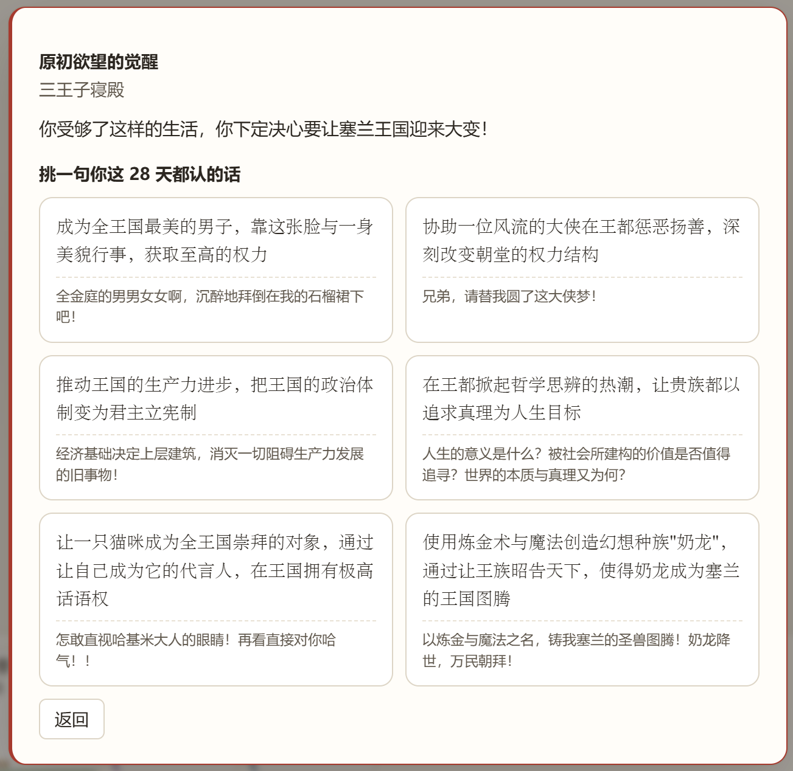
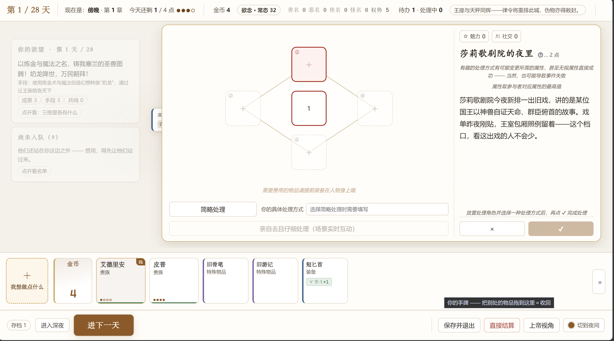
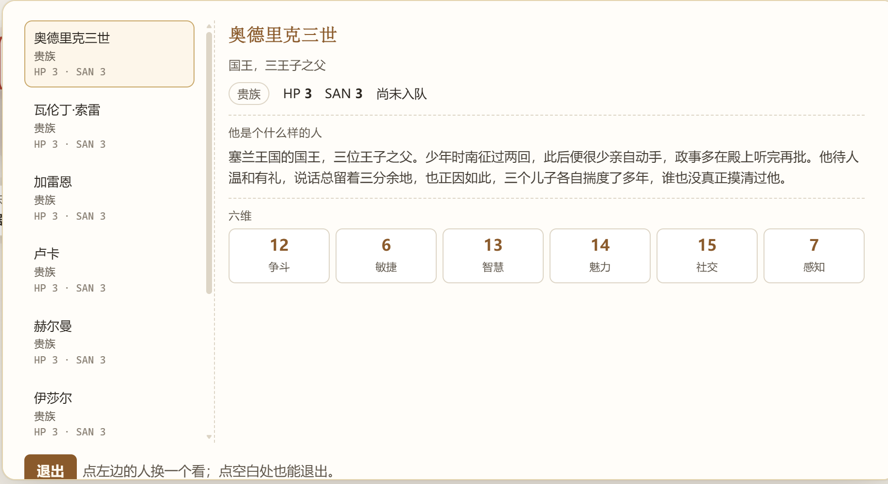
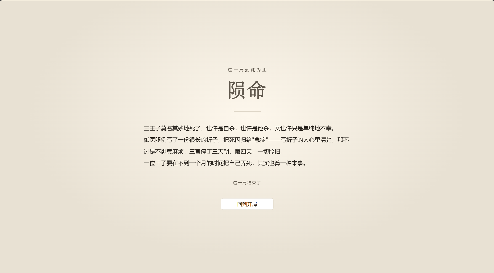

# 《王国三王子》

一款由大语言模型（LLM）驱动的**西幻王国叙事肉鸽游戏**。

你是王国里的一位王子。塞兰王国的每一天，市集、宫廷、酒馆、神殿都会冒出一桩桩事情——但不同于传统RPG游戏，它们不是写死的剧本，你可以和LLM**共创独属于你的故事**；也不同于简单的AI文游，我们做好了优秀的游戏系统来保证**剧情的连贯合理**，和LLM的稳定输出，也设计了美观的**卡牌交互UI**来降低打字的疲劳感！

游戏界面展示（请查询饺子醋😋）：

   
 


  
 

## 玩法简介

- **事件驱动的一天**：每天 AI 会根据你的处境、声望、随从的境况生成若干事件。你可以**派人去办**（消耗行动点），也可以**亲自去且仔细处理**（进入实时对话场景，和事件里的人当面交涉，AI 实时流式回应你说的每一句话）。
- **你的话就是操作**：处理方式不受按钮限制。想赊账、砍价、用嘴皮子绕过本该付的金币？可以直接说——对方买不买账，由 AI 结合世界观、人物属性和你的声望来裁定。
- **有趣的方案有奖励**：一条有意思的处理思路，可能变更事件所需的判定属性、甚至无视属性直接成功——当然，也可能翻车。
- **人手是稀缺品**：事情多、行动点不够时，招募更多人手、多路并行处理，是经营的核心之一。
- **多维度结局**：一周目走完按「伟大的成果 / 正当的手段 / 如一的初衷 / 他者的共鸣」四条叙事维度结算。

## 下载

```bash
git clone https://github.com/AI-TRPG-Game/AI-Rougelike-Narrative-Game
```

或者：GitHub 仓库页面 → **Code → Download ZIP** → 解压到任意目录。

## 准备两样东西

1. **Node.js 22.18 或更新版本**：到 [nodejs.org](https://nodejs.org/) 下载安装（一路默认即可）。项目零依赖、无构建步骤，Node 直接运行 TypeScript 源码——**直接跑 `.ts` 需要 22.18+ 才默认开启**，所以版本别低于它（拿不准就装官网最新 LTS）。
2. **模型 API Key**：可以使用 DeepSeek 或 SoCLaaS。DeepSeek 密钥可到 [platform.deepseek.com](https://platform.deepseek.com/) 创建；SoCLaaS 使用自己的服务密钥。实际费用及试用额度以服务商和账号为准。

然后配置密钥：

```bash
# 在游戏目录下
复制 game/.env.example 为 game/.env
# 打开 game/.env，把 DEEPSEEK_API_KEY=sk-replace-me 换成你自己的 key
```

### 使用 SoCLaaS / GLM 5.3 Flash

在 `game/.env` 中配置：

```dotenv
LLM_PROVIDER=soclaas
SOCLAAS_API_KEY=your-soclaas-api-key
SOCLAAS_BASE_URL=https://soclaas-api.comp.nus.edu.sg/v1
SOCLAAS_MODEL=x-test-1
```

`SOCLAAS_MODEL` 必须匹配 SoCLaaS 模型列表中的 API 标识。根据服务试用公告，GLM 5.3 Flash 当前使用 `x-test-1`（也是代码默认值）。该试用可能移除或被其他模型替换；可用性以账号和当前服务为准，名称变化时修改这一行即可。离线测试不代表已通过真实 GLM 游戏验收。

设置 `LLM_PROVIDER=deepseek` 可切回原来的 DeepSeek 配置。未填写 `LLM_PROVIDER` 时，有 `SOCLAAS_API_KEY` 则选择 SoCLaaS，否则保持 DeepSeek。两家密钥分别读取，不混用。修改配置后关闭并重新启动游戏；密钥只保存在后端的 `game/.env`，不要提交。

SoCLaaS 支持相同的结构化工具调用和场景流式路径。请求使用标准 JSON Schema，不发送 DeepSeek 的 `strict` 扩展或 `thinking` 字段；输出仍经过游戏原有校验。默认不发送未经确认的推理参数，仅在服务支持时可设置 `SOCLAAS_REASONING_EFFORT=none/low/medium/high`。

离线验证（不访问模型 API）：`node game/src/test/run.mjs llm-provider prompt scene`。

## 启动

**双击根目录的「启动游戏.vbs」**——它会先自动清掉上一个游戏服务（避免残留实例出 bug），再启动本地服务（真模型模式），随后打开浏览器进入游戏。

> 也可以用命令行启动：
> 
> ```bash
> node game/src/ui/server.ts --live          # 真模型（与双击 vbs 等效）
> node game/src/ui/server.ts                 # 离线试玩：假 AI、零成本、不花钱，用来熟悉界面
> ```
> 
> 启动后浏览器访问 `http://127.0.0.1:5188`。

**关闭游戏**：双击根目录的「关闭游戏.vbs」即可精准停掉游戏服务（不影响电脑上其他 Node 程序）；也可以直接关掉任务栏里那个最小化的服务端窗口。

## 存档与目录

| 路径            | 内容                             |
| ------------- | ------------------------------ |
| `game/saves/` | 你的存档（本地数据库，4 个槽位），**不会被上传到仓库** |
| `game/runs/`  | 每局真模型的调用证据（留档排查用），不会被上传        |
| `game/.env`   | 你的 API Key，**永远不会**被提交进 git    |

# 
